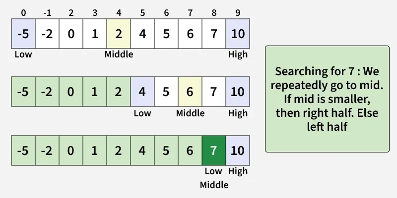

# Binary Search

__Binary Search__ is a searching algorithm that operates on a sorted or monotonic search space, repeatedly dividing it into halves to find a target value or optiomal answer in logarithmic time O(log N).



## Conditions to apply Binary Search

To apply Binary Search algorithm: 
- The data structure must be sorted.
- Access to any element of the data structure should take constant time.

## Algorithm
Step-by-step algorithm for Binary Search:
- Divide the search space into two halves by __findinf the middle index "mid"__.
- Compare the middle element of the search space with the __key__.
- If the __key__ is found at middle element, the process is terminated.
- If the __key__ is not found at middle element, choose which half will be used as the next search.
  - If the __key__ is smaller than the middle element, then the __left__ side is used for next search.
  - If the __key__ is larger than the middle element, then the __right__ side is used for next search.
- This process is continued until the __key__ is found or the total search space is exhausted.

## Implementation
The algorithm can be implemented in two ways: __Iteractive__ and __Recursive__.

### Iteractive
Here it's used a _while_ loop to continue the process of comparing the key and splitting the search space in two halves.

O(log n) Time and O(1) Space

```python
def binary_search(nums: list[int], target: int) -> int:
    left, right = 0, len(nums) - 1
    while left <= right:
        mid = (left + right) // 2
        if nums[mid] > target:
            right = mid - 1
        elif nums[mid] < target:
            left = mid + 1
        else:
            # number found
            return mid
    return -1
```

### Recursive 
Create a recursive function and compare the mid of the search space with the key. And based on the result either return the index where the key is found or call the recursive funtion for the next search space.

O(log n) Time and O (log n) Space

```python
def recursive_binary_search(nums: list[int], target: int, left: int, right: int) -> int:
    if right >= left:
        mid = left + (right - left) // 2
        if nums[mid] > target:
            return recursive_binary_search(nums,target,left,mid-1)
        elif nums[mid] < target:
            return recursive_binary_search(nums,target,mid+1,right)
        else:
            # number found
            return mid
    return -1
```
#### Complexity Analysis
- Time Complexity: 
  - Best Case: O(1)
  - Average Case: O(log N)
  - Worst Case: O(log N)
- Auxiliary Space: O(1), If the recursive call stack is considered then the auxiliary space will be O(log N).

## Applications
- Searching in sorted arrays
- Finding first/last occurrence or closest match in a sorted array
- Database indexing - Used in B-trees and similar structures for fast data lookup
- Debugging in version control - Tools like _git bisect_ use binary search to isolate faulty commits.
- Network routing & IP lookup - Efficiently find routing entries in tables sorted by address ranges
- File systems & libraries - Fast search through sorted directories or symbol tables
- Gaming/graphics - Collision detection or ray tracing using sorted spatial data
- Machine learning tuning - Efficient hyperparameter search (e.g., learning rate, thresholds)
- Optimization problems & competitive programming - Solve boundary-value challenges by narrowing search space
- Advanced data structures - Binary search trees, self-balancing BSTs, and fractional cascading rely on search logic

Source: https://www.geeksforgeeks.org/dsa/binary-search/